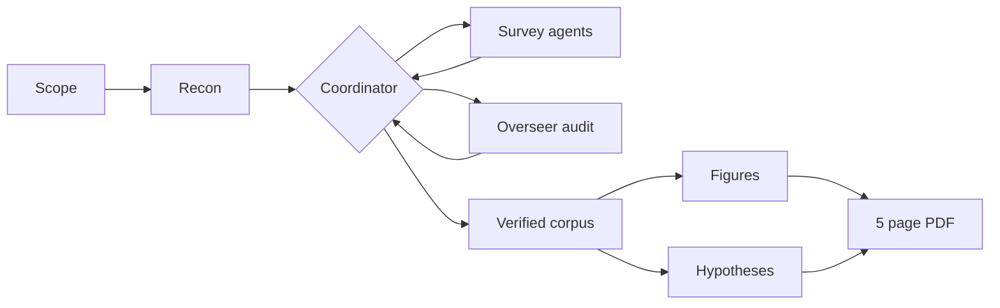

<p align="center">
  
</p>

Claude skills for automated literature surveys: verified corpora, honest metrics, minimal figures, and a short PDF report that tells you who did it best and where the field is heading.

> Ptolemy's *Almagest*, transmitted through Arabic as *al majisti*, "the greatest", was the definitive synthesis of the astronomical state of the art for over a millennium. That is the bar a survey should aim for: not a pile of citations, but the compendium a field measures itself against.

## How a survey runs



## Install

In Claude Code:

```
/plugin marketplace add DanieleMosh/almagest-survey
/plugin install almagest-survey@almagest-survey
```

Or clone and symlink the skill directly:

```bash
git clone https://github.com/DanieleMosh/almagest-survey.git
ln -s "$(pwd)/almagest-survey/skills/literature-survey" ~/.claude/skills/literature-survey
```

Then start a survey with `/literature-survey <your topic>`, or just ask Claude to survey the state of
the art on something.

## Skills

| Skill | What it does |
|---|---|
| [`literature-survey`](skills/literature-survey/SKILL.md) | Runs a state of the art survey on any STEM topic: parallel research agents with an overseer, a DOI verified corpus, open access PDF acquisition, Tufte style seaborn figures, extracted hypotheses, and a compiled LaTeX report of about 5 pages. |

## What a run leaves behind

```
<topic>-survey/
  report.pdf             the deliverable, about 5 pages
  data/scope.md          the agreed scope, settled with you before any harvesting
  data/papers.csv        the corpus, single source of truth for every count in the report
  data/refs_verified.csv Crossref and arXiv resolution result for every reference
  papers/                retrieved open access PDFs, plus MANIFEST.md for the rest
  figures/               regenerated from papers.csv, so prose and plots cannot drift
```

Every DOI is resolved against Crossref before it reaches the report, unverifiable fields stay blank
rather than being guessed, and papers behind a paywall are listed with links instead of being scraped.

## License

MIT
