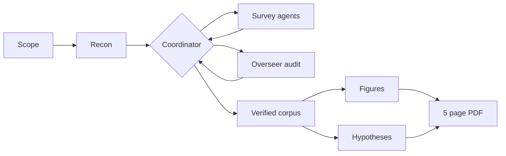

<p align="center">
  
</p>

# Almagest

Claude skills for automated literature surveys: verified corpora, honest metrics, minimal figures, and a short PDF report that tells you who did it best and where the field is heading.

> Ptolemy's *Almagest*, transmitted through Arabic as *al majisti*, "the greatest", was the definitive synthesis of the astronomical state of the art for over a millennium. That is the bar a survey should aim for: not a pile of citations, but the compendium a field measures itself against.

## How a survey runs



## Install

```bash
git clone git@github.com:DanieleMosh/almagest-survey.git
ln -s "$(pwd)/almagest-survey/skills/literature-survey" ~/.claude/skills/literature-survey
```

Or copy `skills/literature-survey/` into your `.claude/skills/` directory.

## Skills

| Skill | What it does |
|---|---|
| [`literature-survey`](skills/literature-survey/SKILL.md) | Runs a state of the art survey on any STEM topic: parallel research agents with an overseer, a DOI verified corpus, open access PDF acquisition, Tufte style seaborn figures, extracted hypotheses, and a compiled LaTeX report of about 5 pages. |

## License

MIT
